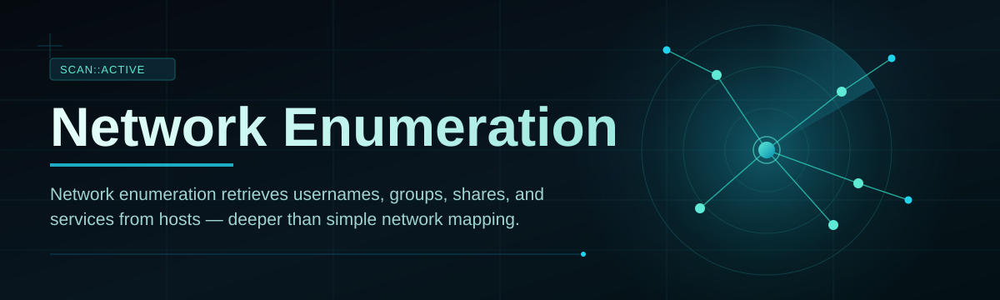
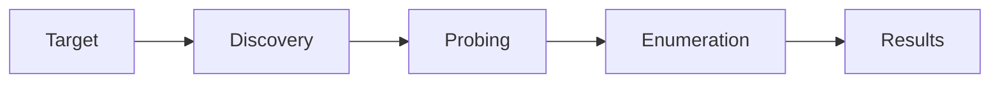

# net-scan-utility 🛰️🔍

  

*Point it at a subnet, get back the truth — hosts, shares, services, and the usernames hiding behind them.*

## 🧭 Overview

Let's get the terminology out of the way because half the internet gets this wrong: **network enumeration** is not the same thing as network mapping. Mapping tells you *which boxes are alive and what OS they're wearing*. Enumeration goes further — it knocks on the doors those boxes left open and asks who lives there. Usernames, group memberships, shared folders, exposed services — the stuff that actually matters when you're trying to understand what a network is *doing*, not just what it *looks like* from a distance.

`net-scan-utility` was built because most tools pick a lane and stay in it. You get a ping sweeper here, an SNMP walker there, an SMB share lister somewhere else, and you end up stitching together three terminal tabs and a spreadsheet just to get a coherent picture of a /24. This tool refuses that compromise. It leans on overt discovery protocols like ICMP and SNMP to find what's alive, then follows up with targeted port and service probing so you're not left guessing what's actually running behind an open socket.

It's aimed at sysadmins doing inventory audits, IT teams onboarding a new office network, students learning how enumeration actually differs from a simple ping sweep, and anyone who has ever stared at a router's DHCP table and thought "okay but what are these things actually *running*." No servers, no telemetry phoning home, no cloud dependency — it's a standalone Windows binary that talks to your network and nothing else.

> [!NOTE]
> This tool is designed for networks you own, administer, or have explicit permission to assess. Enumeration without authorization is a good way to have an uncomfortable conversation with your legal department.

  

---

## 🧰 What's Actually In The Box

Nobody wants a wall of adjectives, so here's what this thing does, described without the usual marketing haze:

- **Host discovery that doesn't lie to you** — ICMP sweeps combined with ARP fallback so devices that block ping still show up if they're on the local segment.

- **SNMP walking for the devices that still expose it** — printers, switches, and legacy gear that broadcast system info to anyone polite enough to ask.

- **Share and service enumeration** — SMB shares, open ports, and banner grabs on common services so you know *what's* running, not just *that* something is.

- **Username and group surfacing** — where permissions allow, pulls local account and group info so you can spot orphaned accounts and stale group memberships before an auditor does.

- **Live results table** — no waiting for a final report; hosts populate the grid as they respond, sortable and filterable in real time.

- **Export that doesn't require a translator** — CSV and JSON output, ready to drop into a spreadsheet or a script without reformatting.

- **Zero footprint installation** — single executable, no background services, no registry sprawl left behind when you delete it.

- **Scheduled scan profiles** — save a subnet + settings combo once, rerun it weekly without re-configuring from scratch.

> [!TIP]
> Save your most-used subnet ranges as named profiles. Rescanning your office VLAN every Monday morning becomes a two-click habit instead of a re-typing chore.

---

## 🚀 Getting Off The Ground

Setup here is refreshingly boring, which is exactly the point:

1. Head to the landing page via the download button above.

2. Grab the latest Windows build — it's a single executable, no installer wizard demanding your soul.

3. Run it. Windows SmartScreen might grumble about an unrecognized publisher on first launch — that's normal for indie tooling, click through it.

4. Enter a target range (single IP, CIDR block, or IP range) and hit scan. Results start populating within seconds.

> [!IMPORTANT]
> Run as Administrator if you want full SMB share and account enumeration. Without elevated privileges, some Windows APIs quietly return partial data instead of erroring out — which is worse, because you won't notice what's missing.

---

## 💻 System Requirements

| Requirement | Detail |
|---|---|
| OS | Windows 10 or Windows 11 (64-bit) |
| Dependencies | None — fully standalone binary |
| Disk space | Under 50 MB |
| Network access | Required, obviously |
| Admin rights | Recommended for full enumeration depth |
| .NET runtime | Bundled, nothing to install separately |

Why no Linux or macOS build?

 

A lot of the deeper enumeration hooks — local group membership, share permission resolution, some SMB internals — lean on Windows-native APIs that don't have a clean cross-platform equivalent without gutting functionality. Rather than ship a watered-down universal build, this stays Windows-first and does that job properly. A Linux-focused sibling tool is a "maybe someday," not a promise.

---

## ⚙️ How It Works

The workflow is intentionally linear — no hidden async magic you can't reason about:

1. **Target definition** — you specify a range; the tool normalizes it into a scan queue.

2. **Discovery pass** — ICMP and ARP requests go out to find live hosts before anything heavier runs.

3. **Service probing** — live hosts get port scanned against a curated list of well-known services.

4. **Deep enumeration** — SNMP, SMB, and account queries run against hosts that responded to service probing.

5. **Aggregation** — everything lands in the results grid, exportable on demand.

---

## 🩺 Troubleshooting

**Q: The scan finds hosts but shows no hostnames, just IPs.**
A: DNS resolution depends on your local resolver actually knowing about those hosts. If they're not in DNS or your hosts file, you'll get IPs — that's expected, not a bug.

**Q: SNMP data is empty for devices I know support it.**
A: Most modern gear ships with SNMP disabled by default, or locked to a community string that isn't `public`. Check the device's admin panel first.

**Q: Windows Defender flagged the executable.**
A: Network enumeration tools trip heuristic detection because of how they touch sockets and system APIs — this is a common false positive category, not unique to this tool.

**Q: Scan is painfully slow on a /16 range.**
A: That's roughly 65,000 addresses — narrow the range or split it into scan profiles. This tool prioritizes accuracy over reckless speed.

**Q: Some hosts show up in discovery but disappear during deep enumeration.**
A: They likely blocked or rate-limited the follow-up probes. Firewalls doing their job, essentially.

**Q: Can I run multiple scan profiles simultaneously?**
A: Yes, but each concurrent scan eats bandwidth and CPU — stagger them if you're on modest hardware.

---

## 🎨 UI / UX Notes

> [!TIP]
> The interface leans dark by default because staring at a bright white grid for an hour-long subnet scan is nobody's idea of fun.

- **Themes** — Dark (default), Light, and a High Contrast mode for accessibility.

- **Keyboard shortcuts**:

  | Shortcut | Action |
  |---|---|
  | `Ctrl + N` | New scan profile |
  | `Ctrl + R` | Re-run last scan |
  | `Ctrl + E` | Export results |
  | `Ctrl + F` | Filter results grid |
  | `Esc` | Cancel active scan |

- **Settings panel** — timeout thresholds, thread count, SNMP community string presets, and export format defaults all live under one gear icon, not scattered across five tabs.

- **Live grid sorting** — click any column header mid-scan; it doesn't freeze the scan to let you sort.

---

## 🤝 Contributing & Community

  

> Found a device type that doesn't enumerate cleanly? Open an issue with the device class (not sensitive network details) and what you expected versus what happened.

Contributions are genuinely welcome — bug reports, feature suggestions, and pull requests for new service detection signatures all move this forward. If you're adding a new enumeration module, keep it read-only and non-destructive; this project has a hard rule against anything that modifies target state.

---

## 📄 License

Released under the [MIT License](LICENSE), 2026. Use it, fork it, build on it — just don't strip the license and pretend you wrote it from scratch.

---

## ⚠️ Disclaimer

> [!WARNING]
> `net-scan-utility` is built strictly for legitimate network administration, auditing, and educational purposes on networks you own or have explicit written permission to assess. Running enumeration against networks without authorization may violate local, national, or organizational policy. The maintainers accept no liability for misuse — this tool is a flashlight, not an excuse.

  

